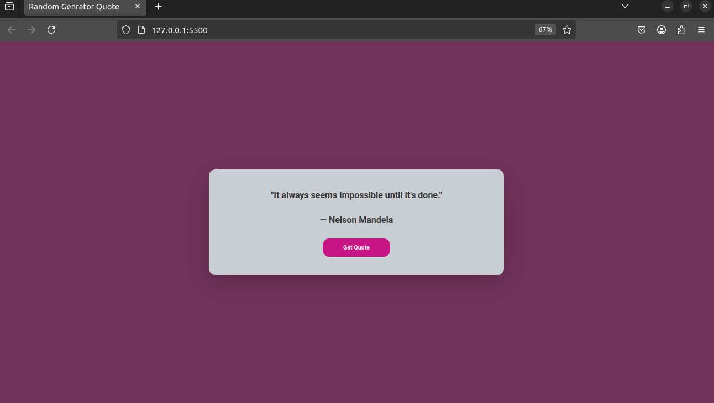

# 📜 Random Quote Generator 
A simple web app that fetches and displays random quotes using a public API, with a fallback to local quotes if the API fails.

# ✨ Features

    Fetches random quotes from the Quotable API

    Fallback to built-in quotes if API fails

    Clean, responsive design

    Loading state during API requests

    One-click new quote generation

# 🛠️ Technologies Used

    HTML5

    CSS3 (Flexbox, responsive design)

    JavaScript (ES6, Fetch API, async/await)

    Quotable API (or Type.fit/Stoic Quotes as alternatives)
